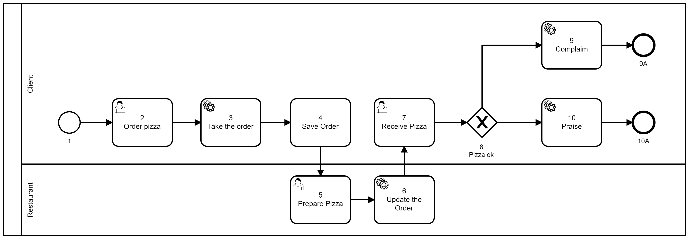
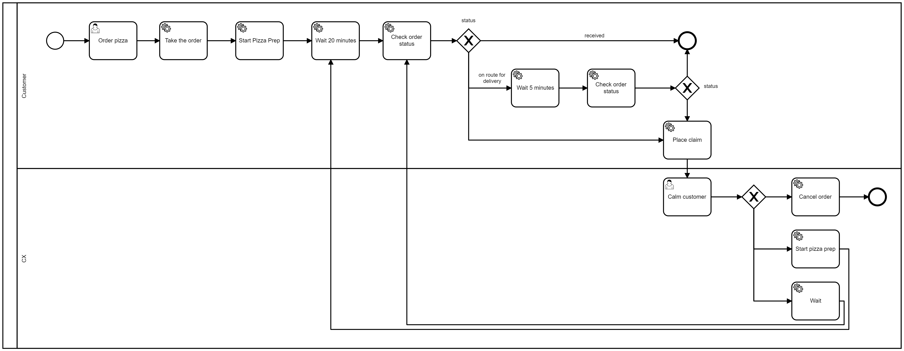
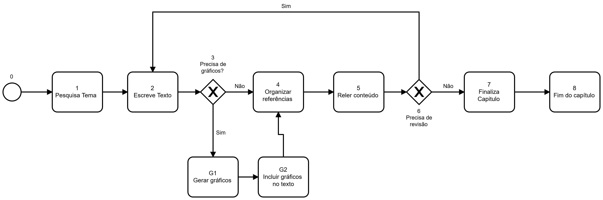
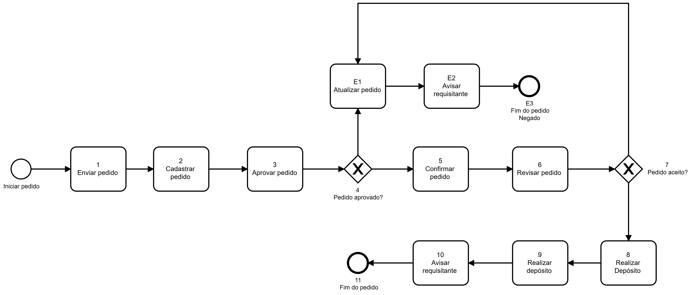

# Exemplos

A seguir, podemos observar alguns exemplos que demonstram a estrutura de uma diagrama e como seria sua blueprint.


## Processo de pedir pizza v1


**Blueprint**

```
{
  "name": "pizza1",
  "description": "pizza1 blueprint example, only systemTasks",
  "blueprint_spec": {
    "requirements": ["core"],
    "prepare": [],
    "nodes": [
      {
        "id": "1",
        "type": "Start",
        "name": "Start Pizza 1 WF",
        "next": "2",
        "parameters": {
          "input_schema": {}
        },
        "lane_id": "1"
      },
      {
        "id": "2",
        "type": "SystemTask",
        "name": "Order Pizza",
        "category": "setToBag",
        "next": "3",
        "lane_id": "1",
        "parameters": {
          "input": {
            "client": { "$ref": "bag.name" },
            "client1": "teste",
            "pizzas": {
              "qty": 2,
              "flavors": ["mussarela", "pepperoni"],
              "olives": false
            }
          }
        }
      },
      {
        "id": "3",
        "type": "SystemTask",
        "name": "Take the order",
        "category": "setToBag",
        "next": "4",
        "lane_id": "1",
        "parameters": {
          "input": {
            "orderNo": { "$js": "() => Math.floor(Math.random() * 100); " }
          }
        }
      },
      {
        "id": "4",
        "type": "SystemTask",
        "name": "Prepare Pizza",
        "category": "Timer",
        "next": "5",
        "lane_id": "1",
        "parameters": {
          "input": {},
          "timeout": 5
        }
      },
      {
        "id": "5",
        "type": "SystemTask",
        "category": "SetToBag",
        "name": "Bring Pizza",
        "next": "6",
        "lane_id": "1",
        "parameters": {
          "input": {
            "comment": {
              "$mustache": "check if there are {{bag.pizzas.qty}} pizzas in the bag"
            }
          }
        }
      },
      {
        "id": "6",
        "type": "SystemTask",
        "category": "setToBag",
        "name": "Receive Pizza",
        "next": "7",
        "lane_id": "1",
        "parameters": {
          "input": {
            "confirm": { "$ref": "bag.orderNo" }
          }
        }
      },
      {
        "id": "7",
        "type": "Finish",
        "name": "Finish node",
        "next": null,
        "lane_id": "1"
      }
    ],
    "lanes": [
      {
        "id": "1",
        "name": "the_only_lane",
        "rule": ["fn", ["&", "args"], true]
      }
    ],
    "environment": {}
  }
}
```

## Processo de pedir pizza v2



```
{
  "name": "pizza2",
  "description": "pizza 2 example, system and userTasks",
  "blueprint_spec": {
    "requirements": ["core"],
    "prepare": [],
    "nodes": [
      {
        "id": "1",
        "type": "Start",
        "name": "Start Pizza 2 WF",
        "next": "2",
        "parameters": {
          "input_schema": {}
        },
        "lane_id": "1"
      },
      {
        "id": "2",
        "type": "UserTask",
        "name": "Order Pizza",
        "next": "3",
        "lane_id": "1",
        "parameters": {
          "action": "ORDER_PIZZA",
          "input": {}
        }
      },
      {
        "id": "3",
        "type": "SystemTask",
        "name": "Take the order",
        "category": "HTTP",
        "next": "4",
        "lane_id": "1",
        "parameters": {
          "input": {
            "status": "pending",
            "qty": {
              "$ref": "result.activities[0].data.qty"
            },
            "flavors": {
              "$ref": "result.activities[0].data.flavors"
            },
            "comments": {
              "$ref": "result.activities[0].data.comments"
            }
          },
          "request": {
            "url": "https://5faabe16b5c645001602b152.mockapi.io/order",
            "verb": "POST",
            "headers": {
              "ContentType": "application/json"
            }
          }
        }
      },
      {
        "id": "4",
        "type": "SystemTask",
        "category": "SetToBag",
        "name": "Save Order",
        "next": "5",
        "lane_id": "1",
        "parameters": {
          "input": {
            "order": {
              "$ref": "result.data"
            }
          }
        }
      },
      {
        "id": "5",
        "type": "UserTask",
        "name": "Prepare Pizza",
        "next": "6",
        "lane_id": "2",
        "parameters": {
          "input": {
            "order": {
              "$ref": "bag.order"
            }
          },
          "action": "PREPARE_PIZZA"
        }
      },
      {
        "id": "6",
        "type": "SystemTask",
        "category": "HTTP",
        "name": "Update Order",
        "next": "7",
        "lane_id": "2",
        "parameters": {
          "input": {
            "status": "done"
          },
          "request": {
            "url": {
              "$mustache": "https://5faabe16b5c645001602b152.mockapi.io/order/{{bag.order.id}}"
            },
            "verb": "PUT",
            "headers": {
              "ContentType": "application/json"
            }
          }
        }
      },
      {
        "id": "7",
        "type": "UserTask",
        "name": "Receive Pizza",
        "next": "8",
        "lane_id": "3",
        "parameters": {
          "action": "RECEIVE_PIZZA",
          "input": {}
        }
      },
      {
        "id": "8",
        "type": "Flow",
        "name": "Pizza ok?",
        "next": {
          "yes": "10",
          "no": "9",
          "default": "10"
        },
        "lane_id": "3",
        "parameters": {
          "input": {
            "ok": {
              "$ref": "result.is_order_ok"
            }
          }
        }
      },
      {
        "id": "9",
        "type": "SystemTask",
        "category": "HTTP",
        "name": "Complaim",
        "next": "9A",
        "lane_id": "3",
        "parameters": {
          "input": {
            "status": "complaim"
          },
          "request": {
            "url": {
              "$mustache": "https://5faabe16b5c645001602b152.mockapi.io/order/{{bag.order.id}}"
            },
            "verb": "PUT",
            "headers": {
              "ContentType": "application/json"
            }
          }
        }
      },
      {
        "id": "10",
        "type": "SystemTask",
        "category": "HTTP",
        "name": "Praise",
        "next": "10A",
        "lane_id": "3",
        "parameters": {
          "input": {
            "status": "praise"
          },
          "request": {
            "url": {
              "$mustache": "https://5faabe16b5c645001602b152.mockapi.io/order/{{bag.order.id}}"
            },
            "verb": "PUT",
            "headers": {
              "ContentType": "application/json"
            }
          }
        }
      },
      {
        "id": "9A",
        "type": "Finish",
        "name": "Finish Complaim",
        "next": null,
        "lane_id": "3"
      },
      {
        "id": "10A",
        "type": "Finish",
        "name": "Finish Praise",
        "next": null,
        "lane_id": "3"
      }
    ],
    "lanes": [
      {
        "id": "1",
        "name": "free lane",
        "rule": ["fn", ["&", "args"], true]
      },
      {
        "id": "2",
        "name": "restaurant lane",
        "rule": [
          "fn",
          ["actor_data", "bag"],
          [
            "eval",
            [
              "apply",
              "or",
              [
                "map",
                ["fn", ["v"], ["=", "v", ["`", "restaurant"]]],
                ["get", "actor_data", ["`", "claims"]]
              ]
            ]
          ]
        ]
      },
      {
        "id": "3",
        "name": "user lane",
        "rule": [
          "fn",
          ["actor_data", "bag"],
          [
            "eval",
            [
              "apply",
              "or",
              [
                "map",
                ["fn", ["v"], ["=", "v", ["`", "user"]]],
                ["get", "actor_data", ["`", "claims"]]
              ]
            ]
          ]
        ]
      }
    ],
    "environment": {}
  }
}
```

## Processo de pedir pizza v3




```
{
    "name": "pizza3",
    "description": "pizza 3 treinamento",
    "blueprint_spec": {
        "requirements": ["core"],
        "prepare": [],
        "environment": {},
        "lanes": [
          {
            "id": "free",
            "name": "free for all",
            "rule": ["fn", ["&", "args"], true]
          },
          {
            "id": "restaurant",
            "name": "restaurant",
            "rule": ["fn", ["actor_data", "bag"],
                    ["eval", ["apply", "or", ["map", ["fn", ["v"],["=", "v", ["`", "restaurant"]]],
                    ["get", "actor_data", ["`", "claims"]]]]]
            ]
          },
          {
            "id": "cx",
            "name": "customer support",
            "rule": ["fn", ["actor_data", "bag"],
                    ["eval", ["apply", "or", ["map", ["fn", ["v"],["=", "v", ["`", "cx"]]],
                    ["get", "actor_data", ["`", "claims"]]]]]
            ]
          }, {
            "id": "customer",
            "name": "creatorOnly",
            "rule": ["fn", ["actor_data", "bag"],
                    ["=", ["get", "bag", ["`", "creatorId"]],
                    ["get", "actor_data", ["`", "actor_id"]]]
            ]
        }
        ],
        "nodes": [
          {
            "name": "Start pizza3",
            "type": "Start",
            "lane_id": "free",
            "id": "1",
            "next": "1-1",
            "parameters": {
              "input_schema": {
                "type": "object",
                "properties": {
                  "id": { "type": "string", "format": "uuid" },
                  "name": { "type": "string" }
                },
                "required": ["name"]
              }
            }
          },
          {
            "id": "1-1",
            "name": "Order Pizza",
            "type": "userTask",
            "lane_id": "free",
            "next": "1-1A",
            "parameters": {
              "action": "ORDER_PIZZA",
              "input": {},
              "activity_manager": "commit"
            }
          },
          {
            "id": "1-1A",
            "name": "bag actor_id",
            "type": "systemTask",
            "category": "setToBag",
            "lane_id": "free",
            "next": "1-1B",
            "parameters": {
              "input": {
                "creatorId": { "$ref": "actor_data.actor_id" },
                "user_data": { "$ref": "result.activities[0].data" }
              }
            }
          },
          {
            "id": "1-1B",
            "name": "bag actor_id",
            "type": "systemTask",
            "category": "setToBag",
            "lane_id": "free",
            "next": "1-2",
            "parameters": {
              "input": {
                "key": { "$js": "({bag}) => (!bag.user_data.qty || !bag.user_data.flavors || bag.user_data.flavors.length == 0) ? false : true" }
              }
            }
          },
          {
            "id": "1-2",
            "name": "is order correct",
            "type": "flow",
            "lane_id": "customer",
            "next": {
              "false": "2-99",
              "true": "1-3",
              "default": "1-3"
            },
            "parameters": {
              "input": {
                "key": { "$ref": "bag.key" }
              }
            }
          },{
            "id": "1-3",
            "name": "take the order",
            "type": "systemTask",
            "category": "http",
            "lane_id": "customer",
            "next": "1-3A",
            "parameters": {
              "input": {
                "status": "pending",
                "qty": { "$ref": "bag.user_data.qty" },
                "flavors": { "$ref": "bag.user_data.flavors"},
                "comments": { "$ref": "bag.user_data.comments" }
              },
              "request": {
                "url": "https://5faabe16b5c645001602b152.mockapi.io/order",
                "verb": "POST",
                "headers": {
                  "ContentType": "application/json"
                }
              }
            }
          },
          {
            "id": "1-3A",
            "name": "bag order",
            "type": "systemTask",
            "category": "setToBag",
            "lane_id": "customer",
            "next": "1-4",
            "parameters": {
              "input": {
                "order": { "$ref": "result.data" }
              }
            }
          },{
            "id": "1-4",
            "name": "acknowledge order",
            "type": "userTask",
            "lane_id": "restaurant",
            "next": "1-5",
            "parameters": {
              "action": "ACKNOWLEDGE_ORDER",
              "activity_manager": "commit",
              "input": {
                  "order": { "$ref": "bag.order" }
              }
            }
          },{
            "id": "1-5",
            "name": "is order ok",
            "type": "flow",
            "lane_id": "restaurant",
            "next": {
              "true": "1-6",
              "false": "3-99",
              "default": "3-99"
            },
            "parameters": {
              "input": {
                "key": { "$ref": "result.activities[0].data.order_ok" }
              }
            }
          },
          {
            "id": "1-6",
            "type": "SystemTask",
            "category": "HTTP",
            "name": "Update Order",
            "next": "1-6A",
            "lane_id": "restaurant",
            "parameters": {
              "input": {
                "status": "started"
              },
              "request": {
                "url": { "$mustache": "https://5faabe16b5c645001602b152.mockapi.io/order/{{bag.order.id}}" },
                "verb": "PUT",
                "headers": {
                  "ContentType": "application/json"
                }
              }
            }
          },{
            "id": "1-6A",
            "name": "bag order",
            "type": "systemTask",
            "category": "setToBag",
            "lane_id": "customer",
            "next": "1-7",
            "parameters": {
              "input": {
                "order": { "$ref": "result.data" }
              }
            }
          },
          {
            "id": "1-7",
            "name": "notify user pizza started",
            "type": "userTask",
            "lane_id": "customer",
            "next": "1-8",
            "parameters": {
              "action": "NOTIFY_USER",
              "input": {
                "orderNo": { "$ref": "bag.order.id" },
                "message": "seu pedido foi iniciado"
              },
              "activity_manager": "notify"
            }
          },
          {
            "id": "1-8",
            "type": "SystemTask",
            "name": "wait 1 minutes",
            "category": "Timer",
            "next": "1-9",
            "lane_id": "customer",
            "parameters": {
              "input": {},
              "timeout": 60
            }
          },{
            "id": "1-9",
            "type": "SystemTask",
            "category": "HTTP",
            "name": "Update Order",
            "next": "1-10",
            "lane_id": "restaurant",
            "parameters": {
              "input": {},
              "request": {
                "url": { "$mustache": "https://5faabe16b5c645001602b152.mockapi.io/order/{{bag.order.id}}" },
                "verb": "GET",
                "headers": {
                  "ContentType": "application/json"
                }
              }
            }
          },{
            "id": "1-10",
            "name": "order status",
            "type": "flow",
            "lane_id": "restaurant",
            "next": {
              "received": "1-99",
              "on_route": "4-1",
              "default": "5-1"
            },
            "parameters": {
              "input": {
                "key": { "$ref": "result.data.status" }
              }
            }
          },
          {
            "id": "1-99",
            "name": "Finish - Order delivered",
            "type": "Finish",
            "lane_id": "customer",
            "next": null
          },
          {
            "id": "2-99",
            "name": "Finish - Order incorrect",
            "type": "Finish",
            "lane_id": "customer",
            "next": null
          },
          {
            "id": "3-99",
            "name": "Finish - Order cannot be done",
            "type": "Finish",
            "lane_id": "customer",
            "next": null
          },
          {
            "id": "4-1",
            "type": "SystemTask",
            "name": "wait 5 minutes",
            "category": "Timer",
            "next": "1-9",
            "lane_id": "customer",
            "parameters": {
              "input": {},
              "timeout": 60
            }
          },{
            "id": "5-1",
            "type": "SystemTask",
            "category": "HTTP",
            "name": "Update Order",
            "next": "5-2",
            "lane_id": "restaurant",
            "parameters": {
              "input": {
                "status": "complaim"
              },
              "request": {
                "url": { "$mustache": "https://5faabe16b5c645001602b152.mockapi.io/order/{{bag.order.id}}" },
                "verb": "PUT",
                "headers": {
                  "ContentType": "application/json"
                }
              }
            }
          },{
            "id": "5-2",
            "type": "userTask",
            "name": "Contact Customer",
            "next": "5-3",
            "lane_id": "cx",
            "parameters": {
              "action": "CONTACT_CUSTOMER",
              "input": {
                "order": { "$ref": "bag.order" }
              },
              "activity_manager": "commit"
            }
          },{
            "id": "5-3",
            "type": "Flow",
            "name": "action",
            "lane_id": "cx",
            "next": {
              "cancel": "6-1",
              "wait": "5-4",
              "default": "5-4"
            },
            "parameters": {
              "input": {
                "decision": { "$ref": "result.activities[0].data.action" }
              }
            }
          },{
            "id": "5-4",
            "type": "systemTask",
            "category": "timer",
            "name": "wait X minutes",
            "lane_id": "cx",
            "next": "1-9",
            "parameters": {
              "input": {},
              "timeout": 60
            }
          },{
            "id": "6-1",
            "type": "SystemTask",
            "category": "HTTP",
            "name": "Update Order",
            "next": "6-99",
            "lane_id": "cx",
            "parameters": {
              "input": {
                "status": "cancel"
              },
              "request": {
                "url": { "$mustache": "https://5faabe16b5c645001602b152.mockapi.io/order/{{bag.order.id}}" },
                "verb": "PUT",
                "headers": {
                  "ContentType": "application/json"
                }
              }
            }
          },
          {
            "id": "6-99",
            "name": "Finish - Order cancelled",
            "type": "Finish",
            "lane_id": "customer",
            "next": null
          }
        ]
    }
}
```

## Processo de empréstimo de livro



```
{
  "name": "example_escrever_capitulo",
  "description": "",
  "blueprint_spec": {
    "environment": {},
    "require": ["core"],
    "prepare": [],
    "lanes": [
      {
        "id": "free",
        "name": "the_only_lane",
        "rule": ["fn", ["&", "args"], true]
      }
    ],
    "nodes": [
        {
            "id": "0",
            "name": "Iniciar Capitulo",
            "next": "1",
            "type": "start",
            "lane_id": "free",
            "parameters": {
                "input_schema": {
                  "type": "object",
                  "properties": {
                    "tema": { "type": "string" }
                  }
                }
            }
        },
        {
            "id": "1",
            "name": "Pesquisa tema",
            "next": "2",
            "type": "userTask",
            "lane_id": "free",
            "parameters": {
                "action": "DO_RESEARCH",
                "input": {}
            }
        },
        {
            "id": "2",
            "name": "Escreve texto",
            "next": "3",
            "type": "userTask",
            "lane_id": "free",
            "parameters": {
                "action": "WRITE_TEXT",
                "input": {}
            }
        },
        {
          "id": "3",
          "name": "Precisa de gráficos",
          "next": {
            "true": "G1",
            "default": "4"
          },
          "type": "flow",
          "lane_id": "free",
          "parameters": {
            "input": {
              "key": { "$ref": "result.activitites[0].data.graphs" }
            }
          }
        },
        {
            "id": "4",
            "name": "Organizar referências",
            "next": "5",
            "type": "userTask",
            "lane_id": "free",
            "parameters": {
                "action": "ORGANIZE_REFS",
                "input": {}
            }
        },
        {
            "id": "5",
            "name": "Reler conteúdo",
            "next": "6",
            "type": "userTask",
            "lane_id": "free",
            "parameters": {
                "action": "REVIEW",
                "input": {}
            }
        },
        {
          "id": "6",
          "name": "Precisa de revisão",
          "next": {
            "true": "2",
            "default": "7"
          },
          "type": "flow",
          "lane_id": "free",
          "parameters": {
            "input": {
              "key": { "$ref": "result.activitites[0].data.review" }
            }
          }
        },
        {
          "id": "7",
          "name": "Finaliza capitulo",
          "next": "8",
          "type": "userTask",
          "lane_id": "free",
          "parameters": {
            "action": "FINALIZE",
            "input": {}
          }
        },
        {
          "id": "8",
          "name": "Fim do capítulo",
          "type": "Finish",
          "lane_id": "free",
          "next": null
        },
        {
          "id": "G1",
          "name": "Gerar gráficos",
          "next": "G2",
          "type": "userTask",
          "lane_id": "free",
          "parameters": {
            "action": "BUILD_GRAPHS",
            "input": {}
          }
        },
        {
          "id": "G2",
          "name": "Incluir gráficos no texto",
          "next": "4",
          "type": "userTask",
          "lane_id": "free",
          "parameters": {
            "action": "MERGE_GRAPHS",
            "input": {}
          }
        }        
    ]
  }
}
```

## Processo de pedido de reembolso



```
{
  "name": "example_pedido_reembolso",
  "description": "",
  "blueprint_spec": {
    "environment": {},
    "require": ["core"],
    "prepare": [],
    "lanes": [
      {
        "id": "usuario",
        "name": "qualquer usuario",
        "rule": ["fn", ["&", "args"], true]
      },
      {
        "id": "gestor",
        "name": "somente para gestores",
        "rule": ["fn", ["&", "args"], true]
      },
      {
        "id": "financeiro",
        "name": "somente depto financeiro",
        "rule": ["fn", ["&", "args"], true]
      }
    ],
    "nodes": [
        {
            "id": "0",
            "name": "Iniciar Pedido",
            "next": "1",
            "type": "start",
            "lane_id": "usuario",
            "parameters": {
              "input_schema": {}
            }
        },
        {
            "id": "1",
            "name": "Enviar pedido",
            "next": "2",
            "type": "userTask",
            "lane_id": "usuario",
            "parameters": {
                "action": "DO_REQUEST",
                "input": {}
            }
        },
        {
            "id": "2",
            "name": "Cadastrar pedido",
            "next": "3",
            "type": "systemTask",
            "category": "http",
            "lane_id": "free",
            "parameters": {
              "request": {
                "url": "url",
                "verb": "POST",
                "headers": {
                  "ContentType": "application/json"
                }
              },
              "input": {
                "status": "pending",
                "amount": { "$ref": "result.activities[0].data.amount" },
                "requester": { "$ref": "result.activities[0].data.requester"},
                "comments": { "$ref": "result.activities[0].data.comments" }
              }
            }
        },
        {
            "id": "3",
            "name": "Aprovar pedido",
            "next": "4",
            "type": "userTask",
            "lane_id": "gestor",
            "parameters": {
                "action": "APPROVE_REQUEST",
                "input": {
                  "status": { "$ref": "result.data.status" },
                  "amount": { "$ref": "result.data.amount" },
                  "requester": { "$ref": "result.data.requester"},
                  "comments": { "$ref": "result.data.comments" }
                }
            }
        },
        {
          "id": "4",
          "name": "Pedido aprovado?",
          "next": {
            "APPROVED": "5",
            "DECLINED": "E1",
            "default": "3"
          },
          "type": "flow",
          "lane_id": "gestor",
          "parameters": {
            "input": {
              "key": { "$ref": "result.activitites[0].data.status" }
            }
          }
        },
        {
            "id": "5",
            "name": "Confirmar pedido",
            "next": "6",
            "type": "systemTask",
            "category": "http",
            "lane_id": "gestor",
            "parameters": {
              "request": {
                "url": "url",
                "verb": "PUT",
                "headers": {
                  "ContentType": "application/json"
                }
              },
              "input": {
                "status": "APPROVED"
              }
            }
        },
        {
            "id": "6",
            "name": "Revisar pedido",
            "next": "7",
            "type": "userTask",
            "lane_id": "financeiro",
            "parameters": {
                "action": "REVIEW_REQUEST",
                "input": {
                  "status": { "$ref": "result.data.status" },
                  "amount": { "$ref": "result.data.amount" },
                  "requester": { "$ref": "result.data.requester"},
                  "comments": { "$ref": "result.data.comments" }
                }
            }
        },
        {
          "id": "7",
          "name": "Pedido aceito?",
          "next": {
            "REVIEWED": "8",
            "DECLINED": "E1",
            "default": "6"
          },
          "type": "flow",
          "lane_id": "financeiro",
          "parameters": {
            "input": {
              "key": { "$ref": "result.activitites[0].data.status" }
            }
          }
        },
        {
            "id": "8",
            "name": "Realizar depósito",
            "next": "9",
            "type": "userTask",
            "lane_id": "financeiro",
            "parameters": {
                "action": "DO_TRANSFER",
                "input": {}
            }
        },
        {
            "id": "9",
            "name": "Realizar depósito",
            "next": "10",
            "type": "systemTask",
            "category": "http",
            "lane_id": "financeiro",
            "parameters": {
              "request": {
                "url": "url",
                "verb": "PUT",
                "headers": {
                  "ContentType": "application/json"
                }
              },
              "input": {
                "status": "SETTLED"
              }
            }
        },
        {
          "id": "10",
          "name": "Avisar requisitante",
          "next": "11",
          "type": "userTask",
          "lane_id": "free",
          "parameters": {
            "action": "NOTIFY_USER",
            "input": {
              "status": { "$ref": "result.data.status" }
            }
          }
        },
        {
          "id": "11",
          "name": "Fim do pedido",
          "type": "Finish",
          "lane_id": "free",
          "next": null
        },
        {
            "id": "E1",
            "name": "Atualizar pedido",
            "next": "E2",
            "type": "systemTask",
            "category": "http",
            "lane_id": "free",
            "parameters": {
              "request": {
                "url": "url",
                "verb": "PUT",
                "headers": {
                  "ContentType": "application/json"
                }
              },
              "input": {
                "status": "DECLINED"
              }
            }
        },
        {
          "id": "E2",
          "name": "Avisar requisitante",
          "next": "E3",
          "type": "userTask",
          "lane_id": "free",
          "parameters": {
            "action": "NOTIFY_USER",
            "input": {
              "status": { "$ref": "result.data.status" }
            }
          }
        },
        {
          "id": "E3",
          "name": "Fim do pedido - recusado",
          "type": "Finish",
          "lane_id": "free",
          "next": null
        }       
    ]
  }
}
```